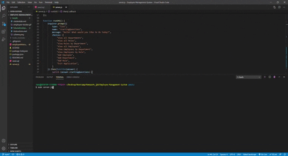

# Employee Management System
  A CLS application where the user is able to view and manage departments, roles, and employees of a company. 
   
  https://github.com/jpbeeson/Employee-Management-System
  ## Table of Contents
  * [Demo](#demo)
  * [Installation](#installation)
  * [Future Development](#futureDevelopment)
  * [Developer's Information](#devInfo)
  * [Credientials](#credientials)
  * [License](#license)
  
  ## Demo
  A video walking through this project can be found [here](https://youtu.be/gGTnU9_07uo) 
   
  This app can be ran after following installation instructions by using 'node server.js' in your terminal. 
  
  
  ## Installation
  To initiate this project, download the Zip file to your computer, extract, and open up the folder in VSCode. Copy, paste, and run the code from "employeeManagement.sql" to create the database, and do the same with "seed.sql" if you would like starter code.

  Open up your terminal and run npm install to receive all packages required for this application.

  ## Future Development
  Currently, this application allows the user to view and add Departments, Roles, and Employees. The user is also given an "Exit Application" prompt. 
  
  To further enhance this application, functionality to the add roles and employees features could be extended by allowing the user to select the roles from a list when adding an Employee, and also by allowing the user to select departments from a list when adding new Roles.

  In addition, deleting Departments, Roles, and Employees would be the next ideal step for this application. Giving each employee a manager feature, and allowing the user to view the manager's current employee responsibility would be another ideal feature. 

  ## Developer's Information
  Feel free to contact me using the information below if you have any questions or feedback!
   
  Name: Jacob Beeson
   
  Github Link: <https://github.com/jpbeeson>
   
  Email: <beeson@gmail.com>
  ## Credientials
  https://www.npmjs.com/package/mysql

  https://www.npmjs.com/package/inquirer/v/0.2.3

  https://www.npmjs.com/package/console.table

  https://docs.npmjs.com/creating-a-package-json-file

  Web Dev Simplified: https://www.youtube.com/watch?v=p3qvj9hO_Bo&t=317s

  Random Name Generator: http://random-name-generator.info/index.php?n=10&g=1&st=3

  https://www.w3schools.com/js/js_object_constructors.asp

  ## License
  MIT License

  Copyright (c) [2020] [JacobBeeson]

  Permission is hereby granted, free of charge, to any person obtaining a copy
  of this software and associated documentation files (the "Software"), to deal
  in the Software without restriction, including without limitation the rights
  to use, copy, modify, merge, publish, distribute, sublicense, and/or sell
  copies of the Software, and to permit persons to whom the Software is
  furnished to do so, subject to the following conditions:

  The above copyright notice and this permission notice shall be included in all
  copies or substantial portions of the Software.

  THE SOFTWARE IS PROVIDED "AS IS", WITHOUT WARRANTY OF ANY KIND, EXPRESS OR
  IMPLIED, INCLUDING BUT NOT LIMITED TO THE WARRANTIES OF MERCHANTABILITY,
  FITNESS FOR A PARTICULAR PURPOSE AND NONINFRINGEMENT. IN NO EVENT SHALL THE
  AUTHORS OR COPYRIGHT HOLDERS BE LIABLE FOR ANY CLAIM, DAMAGES OR OTHER
  LIABILITY, WHETHER IN AN ACTION OF CONTRACT, TORT OR OTHERWISE, ARISING FROM,
  OUT OF OR IN CONNECTION WITH THE SOFTWARE OR THE USE OR OTHER DEALINGS IN THE
  SOFTWARE.
